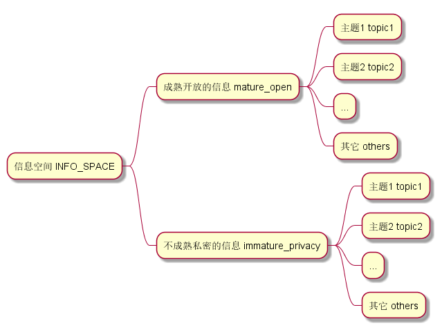
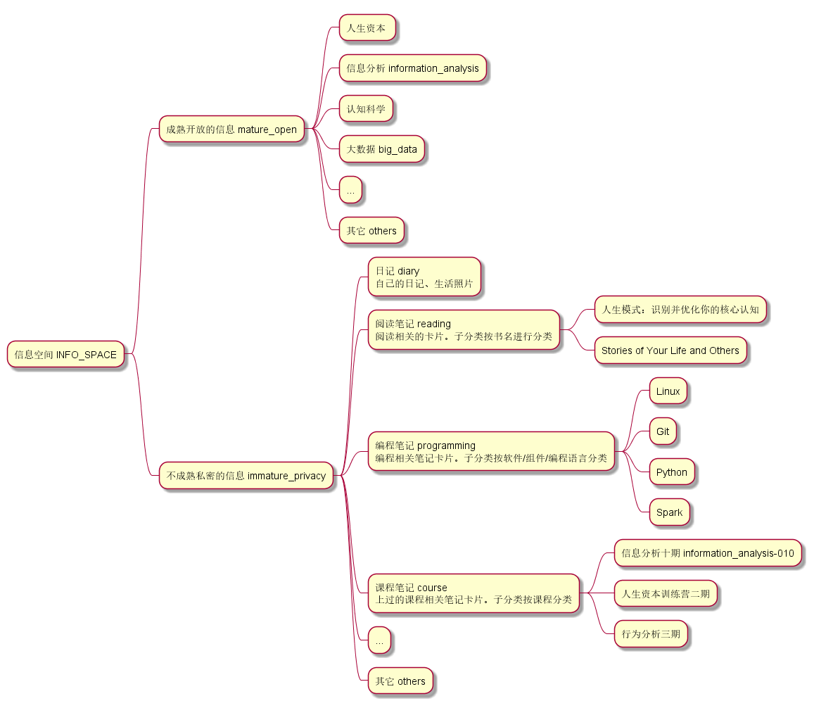
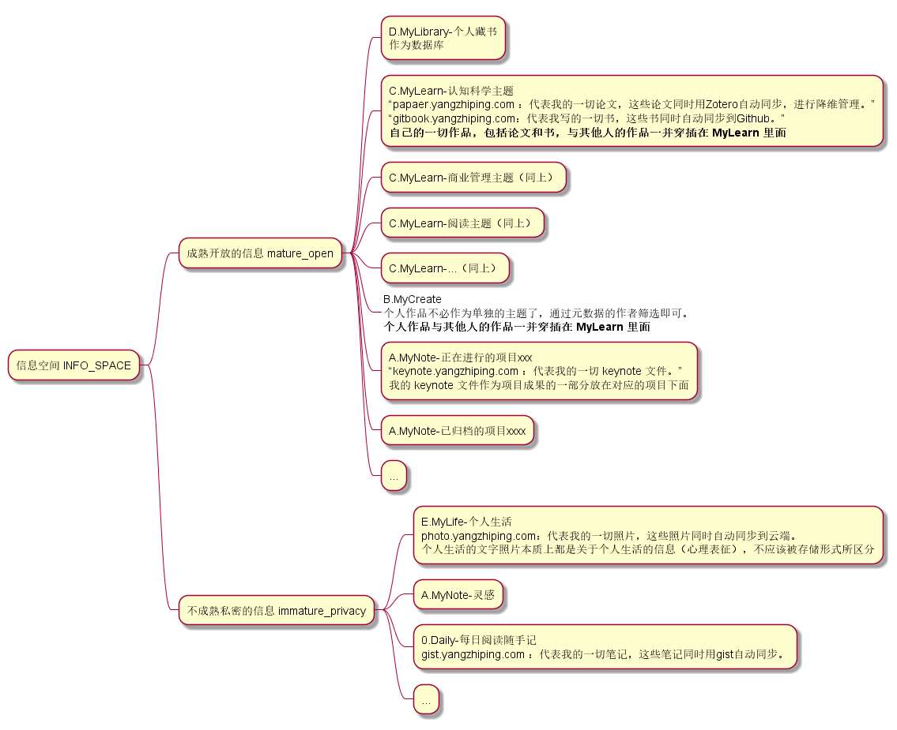

# 信息空间（ information space ）

信息空间是一种管理信息的底层协议

~~在信息分析中，信息空间可以作为信息整理环节的利器（信息搜集 -> **信息整理** -> 信息加工 -> 信息报告）~~

结合了认知科学原理（<font color=red>临时分类、心理表征</font>）

一、笔记、信息

二、分类

三、更多元数据

0/日记/2022/01/01/一次美丽的邂逅 *随便我怎么写*

1/文学/一次美丽的邂逅

1/美术/一次美丽的邂逅

> wiki的本地搭建包叫做：gollum。
>
> https://www.yangzhiping.com/tech/gollum.html

[toc]

## 一、信息空间的底层分类



- 在信息空间（ INFO\_SPACE ）中：从**社会的宏观角度**看，将信息分为【成熟开放的信息（ mature\_open ）】、【不成熟私密的信息（immature\_privacy ）】两类。成熟开放的信息是指可以作为作品在社会上流通的信息；不成熟私密的信息是指比较随意、不具有分享性、积累周期比较短的信息，比如卡片。
  - 在成熟开放的信息（ mature\_open ）中：它的子分类主要按能**出作品的主题角度**来分类，比如某个学科、领域。因为对元数据要求比较高，必要的时候可使用 zotero 工具管理
  - 在不成熟私密的信息（ immature\_privacy ）中：它的子分类可以是按照工作、生活或学习几个方面的**积累的角度**来分类，比如读书笔记、课程笔记。

## 二、信息空间的实践



我的信息空间文件夹打印出来的文件层级（有删减）：

```
INFO_SPACE
├───immature_privacy
│   ├───course
│   │   ├───information_analysis_010
│   │   │   ├───exercise
│   │   │   ├───MethodCard
│   │   │   └───TermCard
│   │   └───HumanNature
│   │       ├───cards
│   │       ├───exercise
│   │       ├───HumanNatureSystem
│   │       │   ├───cards
│   │       │   └───_pumls
│   │       ├───HumanNatureSystemGame
│   │       │   └───cards
│   │       ├───HumanNatureSystemMethodology
│   │       │   └───cards
│   │       └───人性系统发展
│   ├───diary
│   ├───inspiration
│   ├───others
│   ├───programming
│   │   ├───Git
│   │   ├───Linux
│   │   │   ├───shell
│   │   │   └───_attachments
│   │   ├───Python
│   │   └───Spark
│   ├───reading
│   │   ├───Stories of Your Life and Others
│   │   ├───人生模式：识别并优化你的核心认知
│   │   └───黄金时代
│   └───watching
│       ├───Documentary
│       └───Films
└───mature_open
    ├───big_data
    ├───information_analysis
    │   ├───OSINT
    │   └───WebCrawler
    └───others
```

最小行动：如何开始搭建一个信息空间？可以是从创建一张卡片（数据）和定义这张卡片的分类（元数据）开始。

## 三、总结

1. 在信息空间，所有信息有且仅有两个基本表现形式：1. 数据（文件）；2. 元数据（文件描述）
2. 信息空间的元数据。分类作为文件路径也是元数据的一部分，这么看来，在信息空间中，所有文件其实是平铺的，有了分类后才形成了各层级的文件夹。分类是思维的外在体现，好的分类能引导思考，坏的分类会破坏思考。除此之外，元数据还包括比如【作者】、【时间】、【类型】……，元数据规范可参考 zotero 。不过即使没有 zotero ，也可以通过重新**定义元数据标准**，来定制一个信息空间。
3. 从认知的角度对信息（文件）进行归类，而不是从信息介质。比如，把文字的日记（ txt 或 markdown）和生活照片（png 或 jpg）都作为同一类放在`/信息空间/不成熟私密的信息/日记`（`/INFO_SPACE/immature_privacy/diary` ）这一个子分类下面。
4. 利用信息空间的归类思路。每当遇到（或创作）一个信息（或文件）时，就按照 信息空间 的底层协议的思路来给它归类，比如自己写了一个卡片：`/信息空间/不成熟私密的信息/阅读/人生模式`（ `/INFO_SPACE/immature_privacy/reading/人生模式` ） 分类下的xx卡片。又比如找到了（或创作了）一个信息分析工具箱：`/信息空间/成熟开放的信息/信息分析/OSINT`（`/INFO_SPACE/mature_open/information_analysis/OSINT` ）分类下的信息分析工具箱。定好一、二层的底层分类后，后面层级的分类个人决定的自由度很高。
5. 信息空间引导作品的输出。在【成熟开放的信息（ mature_open ）】分类下，按照主题去搜集信息与输出作品。这样可以倒逼自己去深入理解某个领域，在获得全局认识、足够优质信息的基础上，再在一堆优秀的作品中进行输出作品。
6. 信息空间的宗旨：“关注**信息管理**底层协议的科学性，保守使用**信息管理软件**”。思路是主要的，工具是次要的。
7. 信息空间的一级形式是一堆不借助工具的平铺的文件，数据和元数据都以可直接读的形式记录在文件中；二级形式是只借助文件系统中文件夹（或目录）分层级的树形的文件，分层级的文件夹（或目录）就是文件元数据中的“分类”；三级形式借助少量管理工具（比如 shell 命令或脚本、typora 软件、zotero 软件）。

## 四、实例

### 实例一：三种信息结构在信息空间的体现

在【初识 Zotero 】的视频中，我知道了信息原来有这三种结构：

> 三种信息结构：
>
> - 强信息结构
>
>   元数据丰富的专业资料
>
> - 半结构化的信息
>
>   创作的生产资料
>
> - 弱信息结构
>
>   个人卡片
>
> Ref. 信息分析十期/.../初识 Zotero

强信息结构、半结构化的信息多半是已经成熟的作品了，可以放在 `/信息空间/成熟开放的信息/`（ `/INFO_SPACE/mature_open` ）分类下，目前可用 zotero 管理；弱信息结构比如个人卡片，可以放在 `/信息空间/不成熟私密的信息`（ `/INFO_SPACE/immature_privacy` ）分类下。具体视情形而定。

### 实例二：信息整理四原则在信息空间的体现

> 信息整理四原则
>
> 1. 基本属性
>
> 2. 树形结构
> 3. 复用模板
>
> 4. 智能整理
>
> Ref. 信息分析十期/CH7 信息整理/L30: 信息整理的关键操作（三）/推广到更多信息管理软件：信息整理四原则

【基本属性】就是信息空间中信息的元数据；【树形结构】是指元数据中分类遵循树形结构；【复用模板】和【智能整理】在已有的元数据规范的基础上可以很好的进行。

### 实例三：开智v2.0 和阳志平的分类习惯在信息空间的体现

> 
> 
> 
> 
> Ref. 开智学堂

> - yangzhiping.com 代表我的一切个人私人文件。
>   - keynote.yangzhiping.com ：代表我的一切 keynote 文件。
>   - gist.yangzhiping.com ：代表我的一切笔记，这些笔记同时用gist自动同步。
>   - papaer.yangzhiping.com ：代表我的一切论文，这些论文同时用Zotero自动同步，进行降维管理。
>   - gitbook.yangzhiping.com：代表我写的一切书，这些书同时自动同步到Github。
>   - photo.yangzhiping.com：代表我的一切照片，这些照片同时自动同步到云端。
>   - …….
>
> Ref. [构建优雅的知识创造系统 - 阳志平的网志 (yangzhiping.com)](https://www.yangzhiping.com/psy/yang-KnowledgeSystem.html)

目前已有的成熟的分类系统——开智v2.0和阳老师的分类习惯。这些习惯也可以在信息空间中进行重新整合：



如何智能整理：

- 2021一年来的创作：通过元数据中【作者】、【时间】来筛选
- 2021年阅读统计之论文：通过元数据中【添加日期】、【条目类型】来筛选
- 2021年阅读统计之书籍：通过元数据中【添加日期】、【条目类型】来筛选
- ……


---

“信息空间（INFO_SPACE）”的起名方式是对模因的拙劣实践。将底层信息分为成熟开放的信息和不成熟私密的信息两类，受启发于阳老对我们出作品的敦促。以及许多内化的知识，都相当程度的受益于阳老师以及开智学堂，在此表示感谢。
